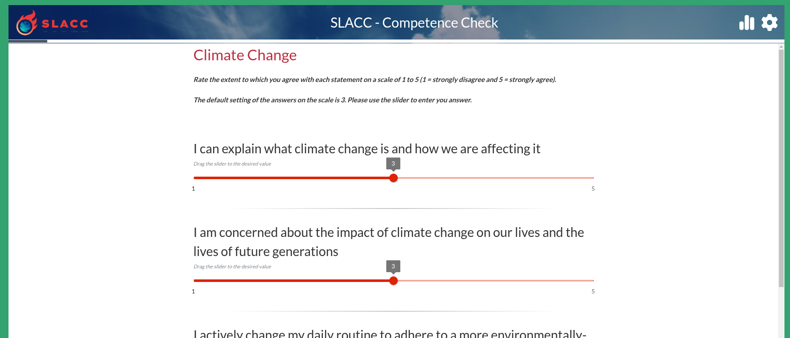
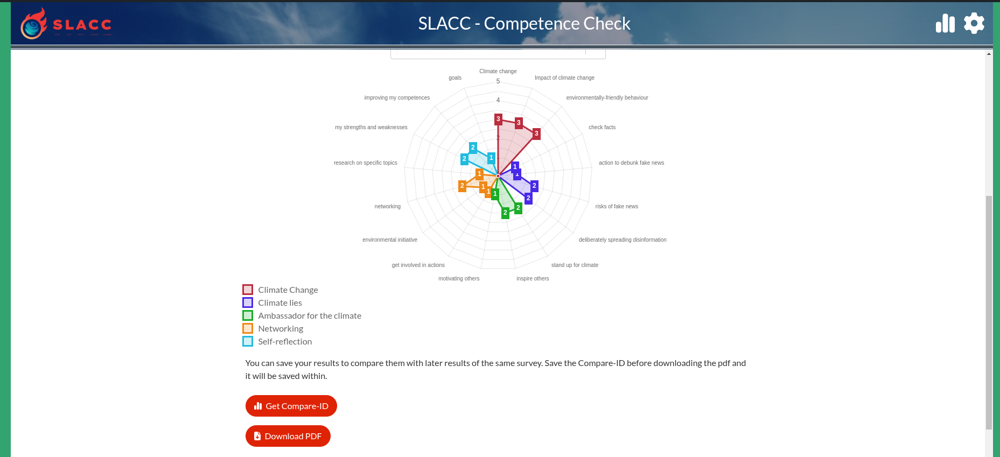
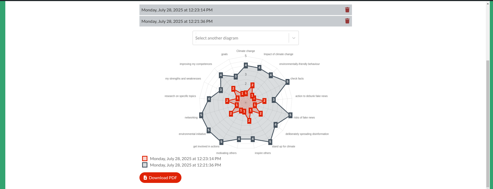

# Comrad Questionnaire Frontend

<p align="center">
  
</p>

<p align="center">
  <strong>The powerful and interactive React frontend for the Comrad Questionnaire System, designed to deliver a seamless and engaging user experience.</strong>
</p>

<p align="center">
  
  
  
  
</p>

This repository contains the frontend application for **Comrad**, a cutting-edge WordPress plugin for creating interactive questionnaires and surveys. Built with **Create React App**, this single-page application (SPA) provides a dynamic and responsive user interface for participants to complete questionnaires created with the Comrad Editor.

## ✨ Architectural Highlights & Core Features

This frontend is not just a simple form renderer; it's a sophisticated application built with a modern and scalable architecture to handle complex logic and provide a superior user experience.

-   **Advanced State Management with Redux:**
    The application uses a centralized **Redux store** to manage the entire application state, including questionnaire data, user answers, and UI state. This ensures a predictable state container and makes debugging and testing significantly easier.

-   **Asynchronous Operations with Redux Saga:**
    Instead of simple thunks, we leverage **Redux Saga**, a powerful middleware that handles all side effects (like fetching XML data or submitting results) in a clean and efficient manner. Sagas make complex asynchronous flows easy to manage, test, and reason about, preventing "callback hell" and keeping our components pure.

-   **Component-Based Architecture with React:**
    Built with modern React (v18), the UI is composed of reusable, declarative components. This promotes a clean separation of concerns and makes the codebase highly maintainable and scalable.

-   **Rich UI with Material-UI (MUI):**
    The user interface is built using **Material-UI**, a comprehensive library of UI components that follows Material Design principles. This provides a polished, professional, and accessible user experience out-of-the-box.

-   **Dynamic Questionnaire Rendering:**
    The application dynamically parses and renders questionnaires from XML data, supporting various question types such as sliders, checkboxes, radio buttons, and text inputs.

-   **Interactive User Experience:**
    Features like multi-page navigation (forward/backward), real-time validation, and interactive charts for results (using **Chart.js**) create an engaging experience for the user.

## Screenshots
   
3. **Frontend Questionnaire**<br />
Embedded questionnaire using the shortcode.
<p align="center" width="100%">
    
</p>

5. **Result Page**<br />
Overview of the results.
<p align="center" width="100%">
    
</p>

6. **Comparison View**<br />
Visual comparison between two result sets.
<p align="center" width="100%">
    
</p>

## 🚀 Getting Started

To set up the project locally, you will need Node.js (version >=18.15.0).

1.  **Clone the repository:**
    ```
    git clone https://github.com/dpohl-web/comrad-questionnaire_public.git
    cd comrad-questionnaire_public
    ```

2.  **Install dependencies:**
    ```
    npm install
    ```

3.  **Run the application:**
    This command starts the development server and automatically handles SASS compilation.
    ```
    npm start
    ```
    The application will be available at `http://localhost:3000`.

## 🛠️ Key Scripts

Here are the most important scripts defined in `package.json`:

| Command       | Description                                                          |
| ------------- | -------------------------------------------------------------------- |
| `npm start`   | Starts the development server with live SASS compilation.            |
| `npm run build` | Bundles the app for production into the `build` folder.              |
| `npm run test`  | Runs the unit tests in interactive watch mode.                       |
| `npm run eject` | Ejects from Create React App for advanced configuration (use with caution). |

## ⚙️ Tech Stack & Key Dependencies

This project leverages a powerful set of modern tools and libraries to deliver a high-quality application:

-   **[Create React App](https://create-react-app.dev/):** The foundation for our build setup, providing a modern development environment with no configuration needed.
-   **[React](https://reactjs.org/) (v18.2.0):** A JavaScript library for building user interfaces.
-   **[Redux](https://redux.js.org/):** A predictable state container for JavaScript apps.
-   **[Redux Saga](https://redux-saga.js.org/):** A Redux middleware for managing application side effects.
-   **[Material-UI (MUI)](https://mui.com/):** A popular React UI framework for faster and easier web development.
-   **[React Router](https://reactrouter.com/):** Declarative routing for React applications.
-   **[Immer](https://immerjs.github.io/immer/):** Simplifies handling immutable state in Redux reducers.
-   **[Reselect](https://github.com/reduxjs/reselect):** Creates memoized, composable selector functions for Redux.
-   **[Chart.js](https://www.chartjs.org/):** A popular charting library for creating responsive and interactive data visualizations.
-   **[Sass](https://sass-lang.com/):** A powerful CSS preprocessor for more maintainable and organized styling.

## License

This project is intended for use with the Comrad WordPress plugin and is subject to its licensing terms.
